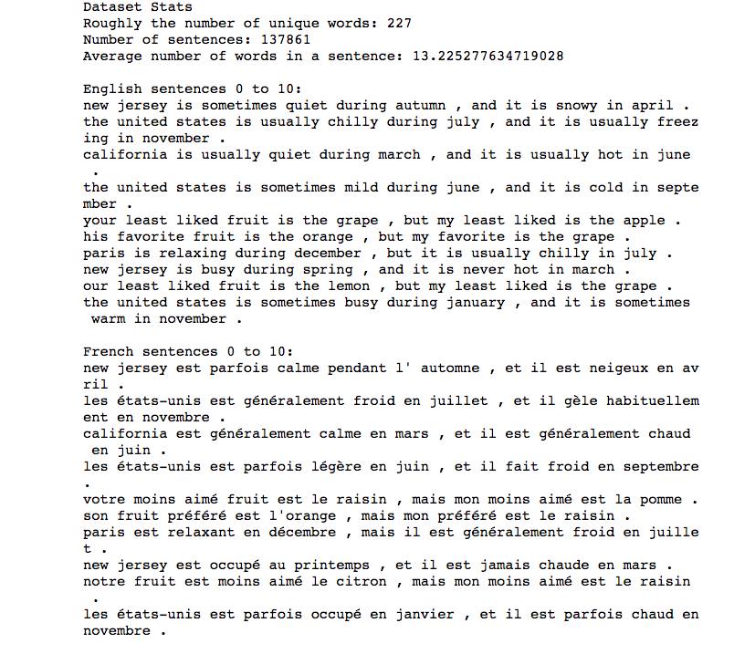
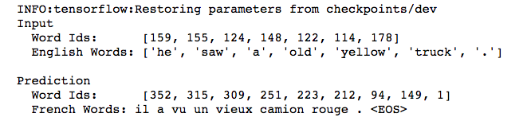

# Language-Translation
Use TensorFlow to create a recurrent neural network that can translate simple phrases from English to French. This model using a sequence to sequence recurrent neural network that translates words one at a time.

A sampling of the dataset:

Results:

